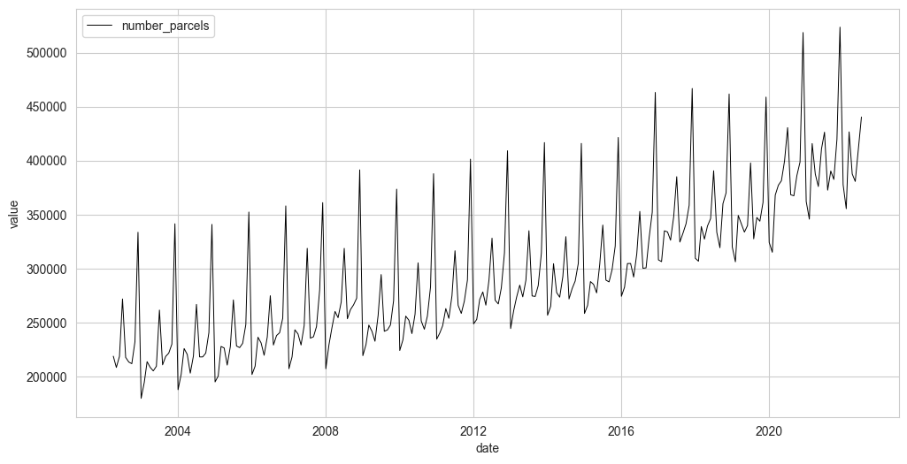

# 状態空間モデルを用いた宅配便取扱数の要因分析

## 1. 概要 (Overview)
本プロジェクトは、国土交通省が公表する「宅配便貨物の取り扱い個数」の月次データ（2002年4月～2022年7月）を用いて、時系列分析を行うものである。

特に、**状態空間モデル**という柔軟なフレームワークを適用することで、観測される時系列の変動を「トレンド」「季節性」「外部イベント（運賃値上げ、コロナ禍など）」の各要素に分解し、それぞれのインパクトを定量的に評価することを目的とする。

## 2. 研究の背景と目的
### 2.1. 先行研究とその課題
本研究は、赤羽根(2024)による研究を先行研究としている。
* 20年分に及ぶ国土交通省のPDF資料から、月次データを手作業で構築。
* SARIMAモデルを用い、データのトレンド・季節性を分離し、主要な変動要因を特定。

一方で、SARIMAモデルの構造上、各イベントが需要に与えた影響を**数値として分離・定量化すること**が困難である、という課題が残されていた。



### 2.2. 本研究の目的
そこで本研究では、先行研究の課題を解決し、より深い知見を得るため、以下の2点を目的した。

1.  **状態空間モデル**を適用し、トレンド・季節性・各イベントの影響を**統計的に分離・定量化**する。
2.  特に、コロナ禍を複数のフェーズに分割してモデル化することで、**パンデミックが市場に与えた影響**を解明する。

## 3. 分析データ
### 3.1. データソース
* **出典**: 国土交通省「交通関係統計資料」
* **対象**: 宅配便貨物の取り扱い個数
* **期間**: 2002年4月～2022年7月
* **頻度**: 月次データ

### 3.2. データ定義
本研究で使用したデータセットの主要なカラムは以下の通りである。

| カラム名  | 内容 |
| :--- | :--- |
| `label` | 年月 (YYYY-MM-DD) |
| `year` | 年 |
| `month` | 月 |
| `Transport_tonnage` | 輸送トン数（トン） |
| `number_parcels` | **[分析対象]** 宅配便取扱個数（千個） |
| `Number_companies_1` | 輸送トン数の調査会社数（社） |
| `Number_companies_2` | 宅配便取扱個数の調査会社数（社）|

* **目的変数**: `number_parcels` の対数値 `log(y)` を使用。

## 4. 分析手法
### 4.1. 分析モデル
以下のような状態空間モデルを構築した。

`観測値 = トレンド + 季節性 + Σ (各イベントの効果) + 観測誤差`

$$x_t = F_tx_{t-1}+G_t\eta_{t}\tag*{(1)システムモデル}$$

$$y_t = H_tx_t+\beta d_t + \epsilon_t \tag*{(2)観測モデル}$$

$$
\begin{bmatrix}
  \eta_{\mu_{t}}  \\
  \eta_{\gamma_{t}}
\end{bmatrix}
\sim N( 0,
\begin{bmatrix}
  \sigma_{\mu_{t}}^2 & 0  \\
  0 & \sigma_{\gamma_{t}}^2
\end{bmatrix})\tag{3}
$$

$$
\epsilon_t
\sim N( 0,
\sigma_{\epsilon_{t}}^2)\tag{4}
$$

* **トレンド**: 一次差分
* **季節性**: 周期12の季節成分。
* **各イベントの効果**: 後述するダミー変数に、それぞれ固有の係数($\beta$)を乗じたもの。この係数をモデルがデータから推定する。

### 4.2. 外生変数（ダミー変数）の設計
モデルに組み込んだ外部イベントは以下の通りである。

| 変数名 | 説明 | 期間 | モデルでの扱い |
| :--- | :--- | :--- | :--- |
| `hike_dummy` | 運賃値上げ | 2017/10 - 2019/12 | 固定係数 |
| `covid_main` | コロナ禍（構造変化） | 2020/03 - | 固定係数 |
| `covid_wave1` | コロナ禍（第一波） | 2020/04 - 2020/05 | 固定係数 |
| `covid_2021` | コロナ禍（2021年） | 2021/01 - 2021/09 | 固定係数 |


## 5. 主要な分析結果
### 5.1. モデル選択のプロセス

## 6. 実行環境のセットアップと実行方法

### 6.1. 必要なライブラリ
本分析に必要なライブラリは `requirements.txt` にまとめた。

```bash
pip install -r requirements.txt

