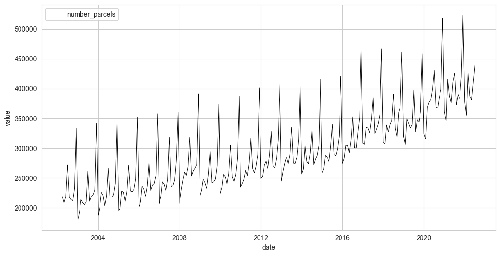

# 状態空間モデルを用いた宅配便取扱数の要因分析

## 1. 概要 (Overview)
本プロジェクトは, 国土交通省が公表する「宅配便貨物の取り扱い個数」の月次データ（2002年4月～2022年7月）を用いて, 時系列分析を行うものである. 

特に, **状態空間モデル**という柔軟なフレームワークを適用することで, 観測される時系列の変動を「トレンド」「季節性」「外部イベント（運賃値上げ, コロナ禍など）」の各要素に分解し, それぞれのインパクトを定量的に評価することを目的とする. 

## 2. 研究の背景と目的
### 2.1. 先行研究とその課題
本研究は, 赤羽根(2024)による研究を先行研究としている. 
* 20年分に及ぶ国土交通省のPDF資料から, 月次データを手作業で構築. 
* SARIMAモデルを用い, データのトレンド・季節性を分離し, 主要な変動要因を特定. 

一方で, SARIMAモデルの構造上, 各イベントが需要に与えた影響を**数値として分離・定量化すること**が困難である, という課題が残されていた. 



### 2.2. 本研究の目的
そこで本研究では, 先行研究の課題を解決し, より深い知見を得るため, 以下の2点を目的した. 

1.  **状態空間モデル**を適用し, トレンド・季節性・各イベントの影響を**統計的に分離・定量化**する. 
2.  特に, コロナ禍を複数のフェーズに分割してモデル化することで, **パンデミックが市場に与えた影響**を解明する. 

## 3. 分析データ
### 3.1. データソース
* **出典**: 国土交通省「交通関係統計資料」
* **対象**: 宅配便貨物の取り扱い個数
* **期間**: 2002年4月～2022年7月
* **頻度**: 月次データ

### 3.2. データ定義
本研究で使用したデータセットの主要なカラムは以下の通りである. 

| カラム名  | 内容 |
| :--- | :--- |
| `label` | 年月 (YYYY-MM-DD) |
| `year` | 年 |
| `month` | 月 |
| `Transport_tonnage` | 輸送トン数（トン） |
| `number_parcels` | **[分析対象]** 宅配便取扱個数（千個） |
| `Number_companies_1` | 輸送トン数の調査会社数（社） |
| `Number_companies_2` | 宅配便取扱個数の調査会社数（社）|

* **目的変数**: `number_parcels` の対数値 `log(y)` を使用. 

## 4. 分析手法
### 4.1. 分析モデル
以下のような状態空間モデルを構築した. 

`観測値 = トレンド + 季節性 + Σ (各イベントの効果) + 観測誤差`

$$x_t = F_tx_{t-1}+G_t\eta_{t}\tag*{(1)システムモデル}$$

$$y_t = H_tx_t+\beta d_t + \epsilon_t \tag*{(2)観測モデル}$$

$$
\begin{bmatrix}
  \eta_{\mu_{t}}  \\
  \eta_{\gamma_{t}}
\end{bmatrix}
\sim N( 0,
\begin{bmatrix}
  \sigma_{\mu_{t}}^2 & 0  \\
  0 & \sigma_{\gamma_{t}}^2
\end{bmatrix})\tag{3}
$$

$$
\epsilon_t
\sim N( 0,
\sigma_{\epsilon_{t}}^2)\tag{4}
$$

* **トレンド**: 一次差分
* **季節性**: 周期12の季節成分. 
* **各イベントの効果**: 後述するダミー変数に, それぞれ固有の係数($\beta$)を乗じたもの. この係数をモデルがデータから推定する. 

### 4.2. 外生変数（ダミー変数）の設計
モデルに組み込んだ外部イベントは以下の通りである. 

| 変数名 | 説明 | 期間 | モデルでの扱い |
| :--- | :--- | :--- | :--- |
| `hike_dummy` | 運賃値上げ | 2017/10 - 2019/12 | 固定係数 |
| `covid_main` | コロナ禍（構造変化） | 2020/03 - | 固定係数 |
| `covid_wave1` | コロナ禍（第一波） | 2020/04 - 2020/05 | 固定係数 |
| `covid_2021` | コロナ禍（2021年） | 2021/01 - 2021/09 | 固定係数 |


## 5. 主要な分析結果
### 5.1. モデル選択のプロセス

## 6. 再現可能な分析手順

このリポジトリは, 日本国内の宅配便取扱個数の月次時系列を対象に, 状態空間モデルを用いてトレンド, 季節性, 外部イベント効果を分離・定量化する研究プロジェクトである.

正規の分析入口は `scripts/run_analysis.py` である. Notebook は探索履歴として残しているが, 論文に用いる正規結果は `scripts/run_analysis.py` から再生成する.

### 6.1. 入力データ

分析に用いる入力データは以下である.

```text
data/raw/Transport_amount_data.csv
```

### 6.2. Python環境

仮想環境を有効化し, 必要なライブラリをインストールする.

```bash
source .venv/bin/activate
pip install -r requirements.txt
```

### 6.3. 分析実行

以下を実行すると, データ読み込み, 特徴量作成, canonical model の推定, 論文用の表と図の生成を行う.

```bash
python scripts/run_analysis.py
```

主な生成物は以下である.

表:

```text
output/tables/model_comparison.tex
output/tables/final_model_params.tex
```

図:

```text
output/figures/original_series.png
output/figures/decomposition_main.png
output/figures/decomposition_effects.png
```

CSVやログは中間生成物であり, 必要に応じて `scripts/run_analysis.py` から再生成する.

### 6.4. 論文PDFビルド

論文ファイルは以下である.

```text
paper_2/paper_2.tex
paper_2/paper_2.pdf
```

`paper_2.tex` は, `scripts/run_analysis.py` が生成した表と図を読み込む. PDF を更新する場合は, 通常の `latexmk -pdf` ではなく, pLaTeX 系の `platex + dvipdfmx` を使う.

```bash
cd paper_2
platex paper_2.tex
platex paper_2.tex
dvipdfmx paper_2.dvi
```

### 6.5. 注意点

- `output/tables/*.tex` と `output/figures/*.png` は `scripts/run_analysis.py` から再生成される.
- Notebook は探索・試行錯誤の記録であり, 正規の結果生成には使わない.
- `paper_2.tex` は生成済みの表・図を読み込むため, 論文をビルドする前に必要に応じて `python scripts/run_analysis.py` を実行する.
- このプロジェクトでは `jarticle` を使っているため, PDF ビルドには `platex + dvipdfmx` を使う.


## ブランチの切り方
main
= 安定版

feature/...
= 機能追加・基盤整備

experiment/...
= 探索分析・試行錯誤

analysis/...
= ある程度目的が明確な分析

paper/...
= 論文本文や図表修正
